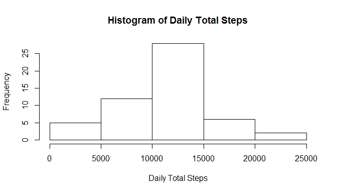
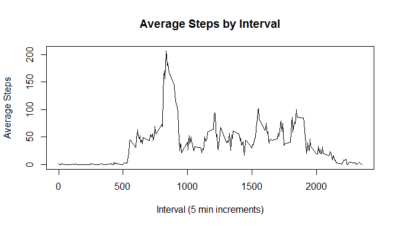
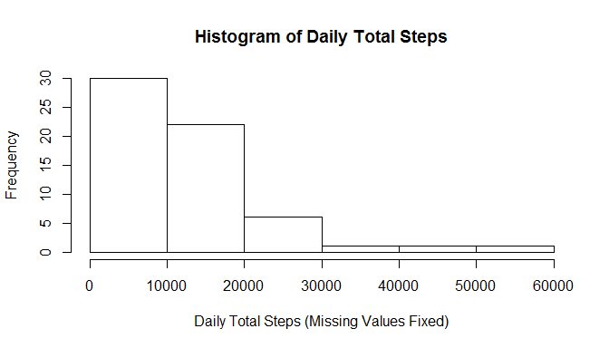
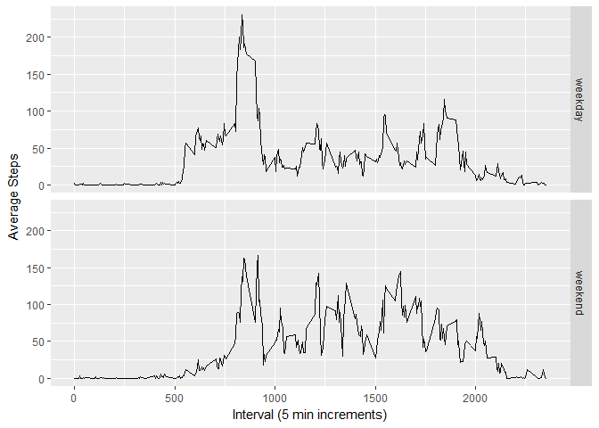

# Reproducible Research: Peer Assessment 1
Created by: Mark Hess (mhess2)
07-08-2017

### Initial Setup
Ensure that all code chunks are visible in the R markdown document.

```r
knitr::opts_chunk$set(echo = TRUE)
```

### Loading and preprocessing the data
**Step 1:** Unzip the activity data, load into R, and format the date field.

```r
unzip(paste0(getwd(),"/activity.zip"))
dat <- read.csv(paste0(getwd(),"/activity.csv"), header = TRUE)
dat$date <- as.Date(dat$date, "%Y-%m-%d")
```

### What is mean total number of steps taken per day?
**Step 1:** Calculate the total number of steps taken per day.

```r
dts <- aggregate(dat$steps, list(dat$date), FUN=sum)
colnames(dts) <- c("date", "total_steps")
# print(dts)
```

**Step 2:** Create a histogram of the daily total steps.

```r
hist(dts$total_steps, main = "Histogram of Daily Total Steps",
     xlab = "Daily Total Steps")
```

<!-- -->

**Step 3:** Calculate the mean and median of the daily total steps.

```r
mean(dts$total_steps, na.rm = TRUE)
```

```
## [1] 10766.19
```

```r
median(dts$total_steps, na.rm = TRUE)
```

```
## [1] 10765
```

### What is the average daily activity pattern?
**Step 1:** Make a time series plot.

```r
ada <- aggregate(dat$steps, list(dat$interval), FUN=mean, na.rm=TRUE)
colnames(ada) <- c("interval", "avg_steps")
plot(ada$interval, ada$avg_steps, type="l", main="Average Steps by Interval", 
     xlab="Interval (5 min increments)", ylab="Average Steps")
```

<!-- -->

**Step 2:** Find the maximum average steps accross all intervals.

```r
max(ada$avg_steps)
```

```
## [1] 206.1698
```

### Imputing missing values
**Step 1:** Calculate the total number of rows with missing values.

```r
sum(rowSums(is.na(dat)))
```

```
## [1] 2304
```

**Steps 2-3:** Fill in the missing values in the dataset.
*Note:* There are no days with partially missing data. Therefore, each day has either all missing values or no missing values at all. We will use the mean number of steps for each interval to populate dates with missing values.

```r
dat2 <- merge(dat, ada, by="interval", all.x = TRUE)
dat2$steps2 <- ifelse(is.na(dat2$steps)==TRUE, dat2$avg_steps, dat2$steps)
dat2 <- dat2[-c(4)]
```

**Step 4:** Create a new histogram of the daily total steps with the missing values filled in with the average interval values.

```r
dts2 <- aggregate(dat2$steps2, list(dat$date), FUN=sum)
colnames(dts2) <- c("date", "total_steps_fixed")
# print(dts)

hist(dts2$total_steps_fixed, main = "Histogram of Daily Total Steps",
     xlab = "Daily Total Steps (Missing Values Fixed)")
```

<!-- -->

Calculate the new mean and median.

```r
mean(dts2$total_steps_fixed)
```

```
## [1] 10766.19
```

```r
median(dts2$total_steps_fixed)
```

```
## [1] 10351.62
```

The mean and median values are relatively close to the original values, however the histogram shows just how much impact the missing data has on the distribution of values. In the original histogram, the frequency of total steps was bell-shaped and in the new histogram the histogram has an exponential (long-tail) distribution.

### Are there differences in activity patterns between weekdays and weekends?
**Step 1:** Create a weekday/weekday variable in the dataset.

```r
dat2$flag <- as.factor(ifelse(weekdays(dat2$date) %in% c("Saturday", "Sunday"), 
                    "weekend", "weekday"))
```

**Step 2:** Create a panel time sereies plot.

```r
ada2 <- aggregate(dat2$steps2, list(dat2$flag, dat2$interval), FUN=mean)
colnames(ada2) <- c("flag", "interval", "avg_steps2")

require(ggplot2)
```

```
## Loading required package: ggplot2
```

```
## Warning: package 'ggplot2' was built under R version 3.2.5
```

```r
ggplot(data=ada2, aes(x=interval, y=avg_steps2)) + geom_line() + 
    facet_grid(flag ~ .) + labs(x="Interval (5 min increments)",
                                y="Average Steps")
```

<!-- -->
